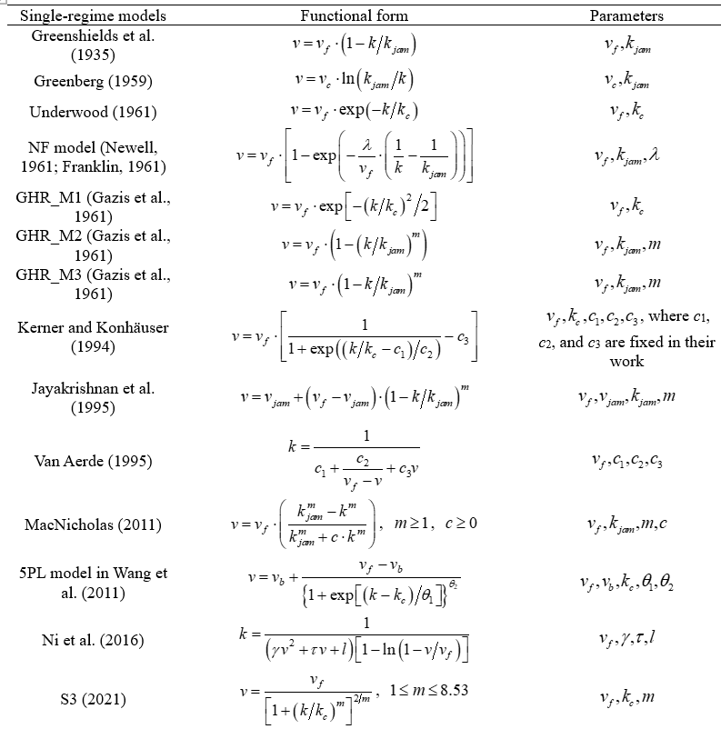
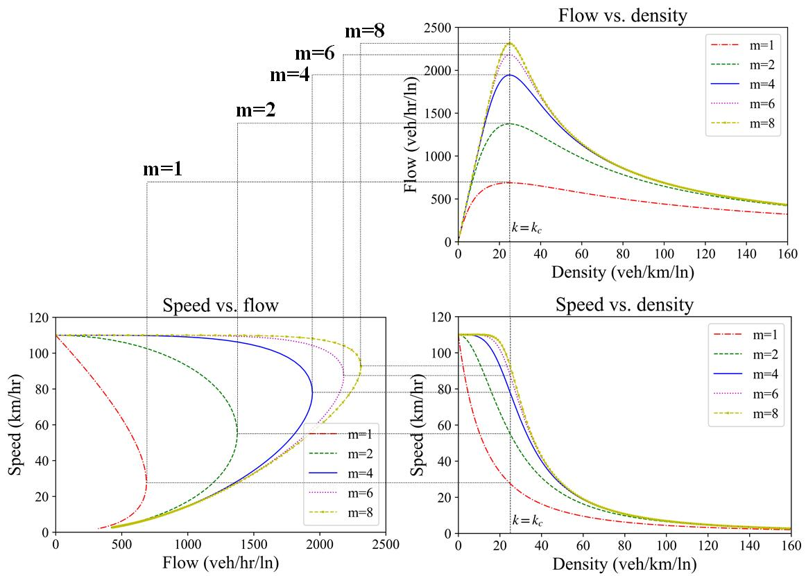
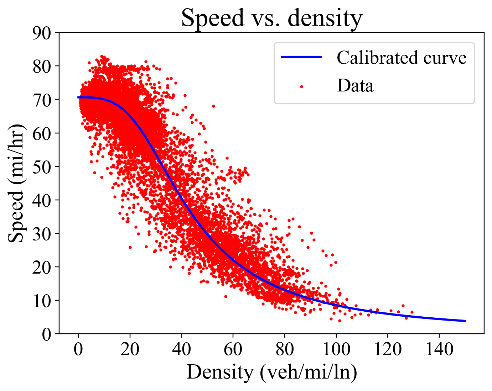
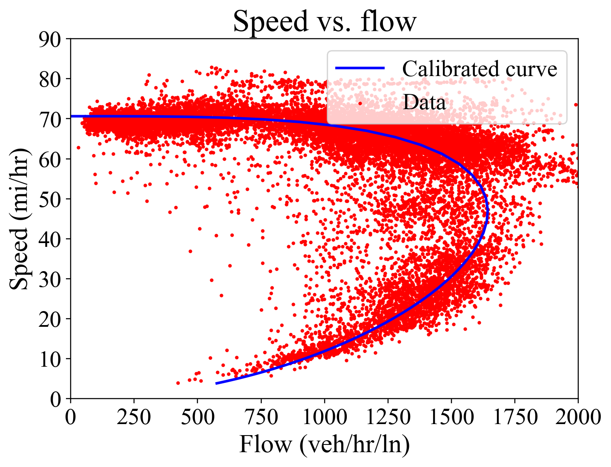
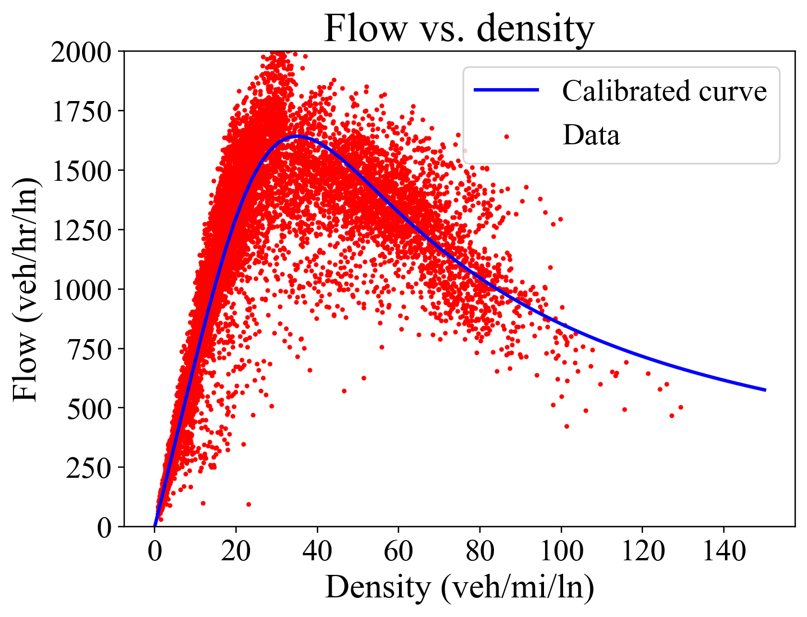
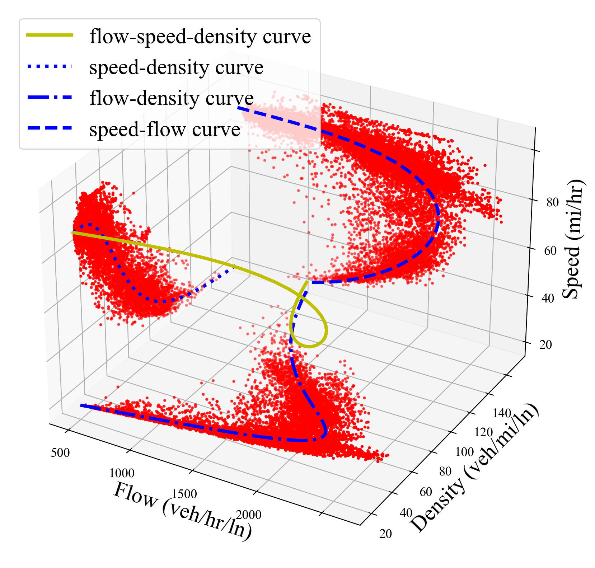

| In mathematics and transportation engineering, traffic flow is the study of interactions between travellers (including pedestrians, cyclists, drivers, and their vehicles) and infrastructure (including highways, signage, and traffic control devices), with the aim of understanding and developing an optimal transport network with efficient movement of traffic and minimal traffic congestion problems. <https://en.wikipedia.org/wiki/Traffic_flow> |
|--------------------------------------------------------------------------------------------------------------------------------------------------------------------------------------------------------------------------------------------------------------------------------------------------------------------------------------------------------------------------------------------------------------------------------------------------------------|

>   This repository aims to provide open-source codes and test data sets for
>   calibrating a wide range of speed-density fundamental diagrams.

>   

In particular, a s-shaped three-parameter (S3) fundamental diagram model is
proposed where vf, kc and m are the free-flow speed, the critical density, and
the flatness-of-curve parameter respectively.

>   

Figure 1: An illustration of the S3 model when *vf* = 110 km/hr and *kc* = 25
veh/km/ln

Some calibration results are shown as follows:

|  (a) speed-density plane |  (b) speed-flow plane             |
|-------------------------------------------------------------------------|----------------------------------------------------------------------------------|
|  (c) flow-density plane  |  (d) 3D flow-speed-density plane  |

Figure 2: Empirical data vs. S3 model

>   **Reference:**

>   Cheng, Q., Liu, Z., Lin, Y., Zhou, X., 2021. An s-shaped three-parameter
>   (S3) traffic stream model with consistent car following relationship. Transportation Research Part B, 153, 246-271. 
>   https://www.sciencedirect.com/science/article/pii/S0191261521001715

>   [(PDF) An s-shaped three-dimensional (S3) traffic stream model with
>   consistent car following relationship
>   (researchgate.net)](https://www.researchgate.net/publication/341104050_An_s-shaped_three-dimensional_S3_traffic_stream_model_with_consistent_car_following_relationship)
